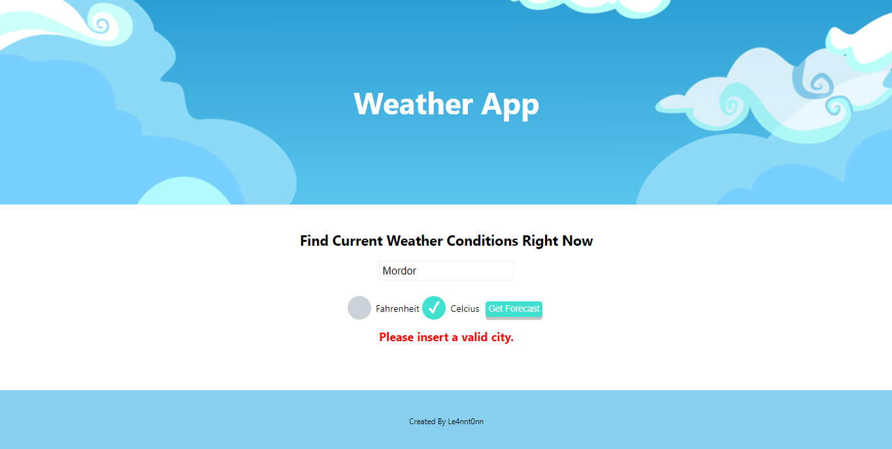

## Weather App

 > A weather app in Reat.

 ***

 

    <h3>[ Weather App 🌞 ]<h3>
    <h5>Check it in 🔍</h5>
    <h3>
         | 
         <a href="https://codesandbox.io/s/github/le4nnt0nn/first-react-project">
            CodeSandBox
        </a>
         | 
    </h3>

***

### 📄 About 

You can check the weather in every city. 

### 🚀 Launch

### `npm start`

Runs the app in the development mode.\
Open [http://localhost:3000](http://localhost:3000) to view it in the browser.

The page will reload if you make edits.\
You will also see any lint errors in the console.

***

### 🧪 Technologies

Used [React](https://es.reactjs.org/ "React Documentation") and [HTML](https://www.w3schools.com/html/ "HTML Documentation").

### 📋 Features

* You can check the weather of a city writting the city name
* If you put a non existing city, an error appears
* You can choose between Fahrenheit or Celcius 
 
### 📷 Templates

#### Example ✔️

#### Example (Error) ❌

